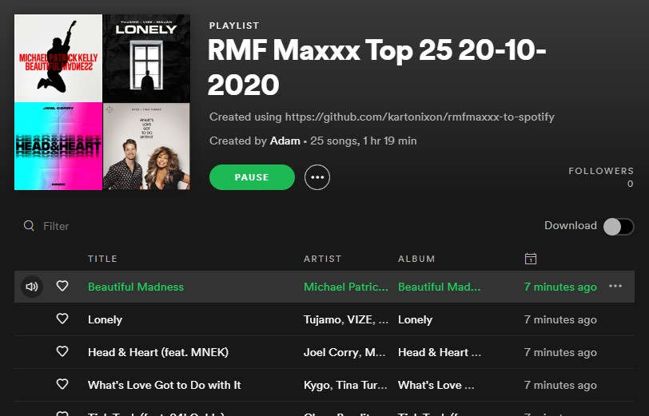

# RMF Maxxx to Spotify

> Listen to the most popular songs from RMF Maxxx radio station without ads!

This awesome script scraps the radio station's website and collects data about the songs that were played during the last 24 hours. After processing collected data, it creates a Spotify playlist from the most frequently played ones.

[**Check out this playlist!**](https://open.spotify.com/playlist/6lRDOxKcHABwHTEDVETApn?si=YCa91VxtTHezZJ6SO4c0og)

## Getting started
- Clone this repository
- Prepare a new virtual environment
- Fill the `config.example.py` file according to Config section and change its name to `config.py`
- Install required packages with `pip install -r requirements.txt`
- Run the script
- In order to authorise your access to Spotify Web API, you will be asked to paste the URL that you were redirected to
- Your access token will be cached in the `.cache` file for later use

## Config
- In order to access Spotify Web API, you need to create a new app using [Spotify for Developers Dashboard](https://developer.spotify.com/dashboard/applications)
- After you create an app, you will be able to fill the missing values with your Client ID and Client Secret in `config.py` file 
- You will need to setup a Redirect URI in settings of your app. You can use the default `http://example.com/callback/`, but remember to add it there!

## Technologies used
- Python
- Spotify Web API

## Contributing
If you have any **issues** with this script or **ideas** on how to improve it, please use GitHub Issues section! Thank you ❤